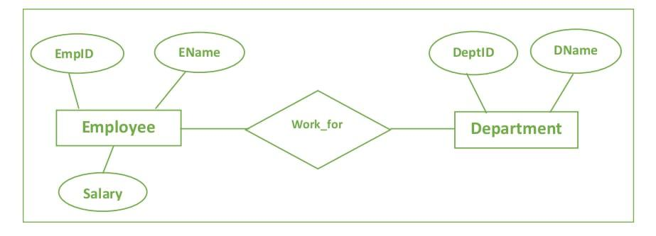
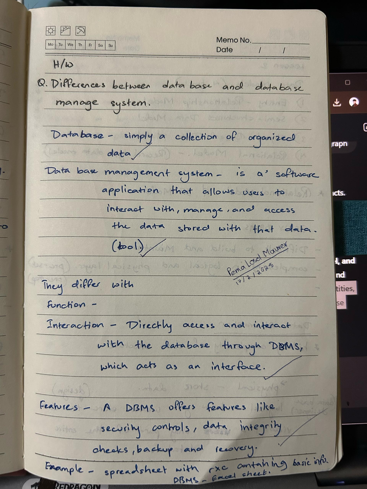

##  Database Fundamental
### --- LESSON 1 ---
#### What i learned from this unit
* A database is a structured collection of data, whereas data refers to raw facts and figures that can be processed to gain meaningful insights

#### Why do we need database
* we need database beacuse it helps store and organize data so it can be easily accessed, managed, and updated. It keeps information secure, reduces errors, and allows multiple users to use the data at the same time

####  Differnce between database and data base administration (HW)
Data: A simple collection of organized data

DBMS: An application that allows users to interact with,manage, and access the data stored with the data.

They differ through:
* Interaction
* Features 
* Function
---
### --- LESSON 2 ---
#### DATA MODELS
##### Types of Data Models:

1) Entity-Relationship Model
2) Semi-structured Data Model
3) Object Based Data Models
4) Relational Model

We also learned about some disadvantages of EARLY DBMS which are 
* difficult to build and maintain 
* complexity in logical and physical layers 

* After this we mainly focused on Entity-Relationship Model & Semi-structured Data Model
### 1. Entity-Relationship Model

#### Components:
* Entity
* Attributes
* Relations
* Keys
* Cardinality

### KEY TAKEAWAYS FROM UNIT ONE 
* database is a structured collection of data, while data refers to raw facts.
* Databases are essential for storing, organizing, and securing information, reducing errors, and allowing multiple users to access data simultaneously.
* The ER model, a major focus, consists of entities, attributes, relations, keys, and cardinality, which help define database structures.

### (HW)

