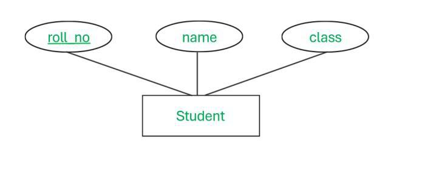

### Key Points from the Notes:
* I found that the ER Model creates databases through entities, attributes, and relationships with primary keys defining entities and foreign keys referencing tables. ACID characteristics guarantee dependable transactions, and schema creation from ER diagrams entails mapping entities to tables and managing relationships. Relational algebra operations such as selection and join assist in querying data, and query optimization enhances efficiency. Declarative languages such as SQL make data retrieval easier by specifying what to retrieve.

#### (class work in the last)
### LESSON 3
#### Entity-Relationship Model (ER Model):
* Developed for database design, representing the logical structure of a database.

#### Components:
* Entity: A distinguishable object in the real world.
* Attributes: Descriptive properties of an entity.
* Relationship: Association between entities, often represented by verbs.

#### Primary Key:
* Uniquely identifies each entity in an entity set.
* Must be unique and not null.
* Indicated by underlining the attribute in ER diagrams.

#### Types of Attributes:
#### (REFENRENCE: PICS ARE DOWNLOADED FROM GEEKS FOR GEEKS)
##### Simple: Cannot be divided into subparts.

##### Composite: Can be divided into subparts.

##### Single-valued: Holds a single value for an entity.

##### Multi-valued: Holds multiple values for an entity. EG:> PHONE_NO

##### Derived: Value can be derived from other attributes or entities.

#### Mapping Cardinalities: In this i mainly focused on the crow's foot notation cardinalities

* One-to-One
* One-to-Many
* Many-to-One
* Many-to-Many

#### Keys:

* Superkey: A set of attributes that uniquely identifies an entity. (combined using pk and fk)

* Primary Key(pk): The chosen candidate key for unique identification.

* Foreign Key(fk): An attribute that references the primary key in another table.

#### Types of Relationships:

* Unary (Recursive): A relationship where an entity is related to itself.

* Ternary: A relationship involving three entities, often many-to-many.

##### Specialization: Dividing an entity set into subclasses based on distinct characteristics.

##### Generalization: Combining multiple entity sets into a higher-level entity set.

### LESSON 4
#### Relational Database Terms:
* Relation: A table.
* Tuple: A row in a table.
* Attribute: A column in a table.
* Schema: Logical design of the database.
* Instance: Snapshot of the database at a specific time.

#### ACID POPERTY:
##### Atomicity:
* Values in a relational model are atomic (indivisible).
* Each cell in a table contains a single value.

##### Consistency:
* Ensures that a transaction brings the database from one valid state to another.
* All data written to the database must follow predefined rules (e.g., constraints, triggers).

##### Isolation:
* Ensures that concurrent transactions do not interfere with each other.
* Each transaction is executed in isolation, as if it were the only transaction running.

##### Durability:
* Ensures that once a transaction is committed, its effects are permanent.
* The changes survive system failures (e.g., power outages, crashes).

### LESSON 5
#### Steps to Convert E-R Diagrams to Relational Schemas:

##### Create Tables for Entities:
* Each entity type becomes a table.
* Single-valued attributes of the entity become columns in the table.
* The primary key of the entity becomes the primary key of the table.

##### Handle Multivalued Attributes:
* Multivalued attributes are represented as separate tables.
* The new table includes the primary key of the original entity and the multivalued attribute.

##### Handle Composite Attributes:
* Only the sub-attributes of a composite attribute are included as columns in the table.

##### Ignore Derived Attributes:
* Derived attributes (e.g., age calculated from date of birth) are not included as columns.

##### Convert Relationships:
* Relationship sets are converted into tables.
* The primary key of the relationship table is a combination of the primary keys of the participating entities.
* Descriptive attributes of the relationship are included as columns.

### LESSON 6
#### Query Languages:
* Used to retrieve information from a database.

#### Categories:
##### Imperative: 
* User provides specific instructions.

##### Functional: 
* Input is given as functions operating on data.

##### Declarative: 
* User describes desired information without specifying steps.

#### Relational Algebra:
* A functional query language that provides a theoretical foundation for relational databases and SQL.
* Operates on relations (tables) to produce new relations.

#### Relational Algebra Operators:

##### Unary Operators (operate on a single relation):
* Selection (σ): Filters tuples based on a condition.
* Projection (Π): Selects specific columns from a relation.

##### Binary Operators (operate on two relations):
* Union (∪): Combines tuples from two relations, removing duplicates.
* Intersection (∩): Retrieves tuples common to both relations.
* Difference (–): Retrieves tuples in the first relation but not in the second.
* Cartesian Product (×): Combines every tuple from the first relation with every tuple from the second.
* Join (⋈): Combines tuples from two relations based on a condition.

#### Join Operation:
* Combines tuples from two relations based on a condition.
* Avoids unnecessary tuples by filtering during the join process.

#### Query Optimization:
* The order of operations impacts performance.
* Example: Applying selection before a join reduces the number of tuples processed.

#### Declarative vs. Imperative:
* Declarative: Focuses on what to retrieve.
* Imperative: Requires explicit instructions for data retrieval.

### CLASS ASSIGNMENT
