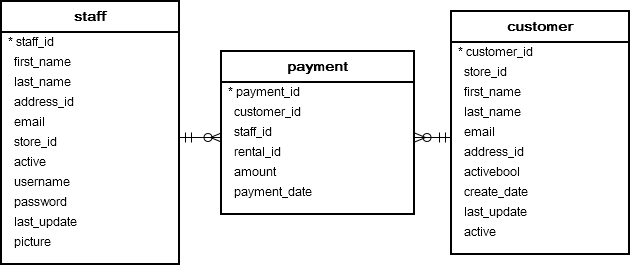

## --- Lesson 9 ---
### SQL Joins
#### Natural Join:
Combines tables based on common columns.
Eliminates duplicate columns.
Requires at least one common attribute.

#### Inner Join:
Returns only matching rows from both tables.
Default join type (INNER JOIN or just JOIN).

#### Outer Joins:
LEFT JOIN: Returns all rows from the left table + matched rows from the right (null if no match).
RIGHT JOIN: Returns all rows from the right table + matched rows from the left.
FULL OUTER JOIN: Returns all rows from both tables (null where no match exists).

#### Views
Virtual tables derived from SQL queries.
Do not store data physically; dynamically retrieve data.
Simplify complex queries, enhance security, and customize data presentation.
Updatable Views: Must meet conditions (single base table, no aggregates, etc.).
Materialized Views: Stored physically and updated when base tables change.

#### Integrity Constraints
Ensure data consistency.
Entity Integrity: Primary keys cannot be null.
Referential Integrity: Foreign keys must match primary keys.
Domain Constraints: Valid data types/ranges (e.g., NOT NULL, CHECK).
Key Constraints: Unique or primary key enforcement.

#### SQL Data Types & Schemas
Date/Time Types: DATE, TIME, TIMESTAMP, INTERVAL.
Type Conversion: Use CAST (e.g., CAST(ID AS NUMERIC(5))).
Default Values: Set via DEFAULT (e.g., totcred NUMERIC(3,0) DEFAULT 0).

#### Large Objects:
CLOB (Character Large Object) for text.
BLOB (Binary Large Object) for media.
PostgreSQL alternatives: BYTEA, TEXT, JSONB.

Domains: Custom data types with constraints.
Auto-Increment Keys:
SERIAL (PostgreSQL), IDENTITY (other DBs).
Variants: SMALLSERIAL, BIGSERIAL.

#### Key Takeaways
Joins combine data from multiple tables (inner/outer).

Views abstract and secure data without physical storage.

Constraints maintain data integrity (PK, FK, checks).

PostgreSQL handles large objects differently (BYTEA, TEXT).

Auto-increment keys simplify unique ID generation.

## --- Lesson 10 ---
### Materialized Views
Definition: A physical copy of a query result stored as a table for faster access.
Purpose: Improves performance for complex, frequently run queries by avoiding recomputation.
Features: Must be refreshed manually or automatically when base tables change.

### Row-Level Security (RLS)
Definition: Restricts access to specific rows in a table based on user roles/conditions.
Purpose: Ensures users only see data they’re authorized to (e.g., employees view only their records).

## --- Lesson 11 ---
### Functions vs. Procedures

#### Functions:
* Defined with CREATE FUNCTION.
* Return a single value (e.g., calculated result).
* Can be embedded in SELECT statements.
* Example: Retrieve a patient’s appointments for a specific day.

#### Procedures:

* Defined with CREATE PROCEDURE.
* Perform actions (e.g., inserting data, updating tables).
* Called explicitly with CALL or EXECUTE.
* Example: Schedule a new appointment while checking doctor availability.

### Use Cases
Functions: Ideal for computations or data retrieval (e.g., aggregating values, filtering results).
Procedures: Suitable for transactional operations (e.g., inserting records, enforcing business rules).

### Triggers
Automatically execute in response to database events (e.g., INSERT, UPDATE, DELETE).

#### Common Uses:
* Enforcing complex integrity constraints.
* Automating alerts (e.g., notifying staff of new prescriptions).
* Synchronizing related data across tables.
* Example: A trigger raises an alert when a new prescription is added to the database.

### External Language Integration
* Functions/procedures can be written in languages like Java, C, or Python.
* Risks: External code may introduce security vulnerabilities or instability.
* Safeguards: Some databases use sandbox environments to isolate external code.

### When to Avoid Triggers
#### Replication Scenarios: Triggers might execute unintended actions during backup or replication.
#### Complex Chains: Risk of infinite loops or cascading effects if triggers reference their own tables.
#### Alternatives: Stored procedures or application-level logic may offer better control.

### Key Points

* Functions focus on returning values; Procedures focus on executing actions.

* Triggers automate responses to database changes but require careful design to avoid errors.

#### Examples in EHR Database:
* Function: Fetch patient appointments.
* Procedure: Schedule appointments with availability checks.
* Trigger: Alert for new prescriptions
* Best Practices: Use triggers sparingly, validate external code, and prioritize clarity in business logic

## --- Lesson 11 ---
### Recursive Queries in SQL
#### Definition:
* A recursive query repeatedly references its own result until no new rows are generated.
* Implemented using Common Table Expressions (CTEs) with the WITH RECURSIVE clause.

#### Use Cases:
* Hierarchical data traversal (e.g., organizational charts, product categories, file systems).
* Transitive closure (e.g., finding all paths in a graph, such as flight routes or friend networks).

#### Structure:
* Base Query: Initial step that seeds the recursion.
* Recursive Query: Iteratively processes results until termination.

#### Restrictions:
##### Queries must be monotonic (results grow as iterations progress).
#####  Prohibited constructs:
#####  Aggregation on the recursive view.
* NOT EXISTS with subqueries involving the recursive view.
* Set difference (EXCEPT) involving the recursive view.

### Key Takeaways
#### Joins: Use LEFT JOIN to include unmatched rows; FULL OUTER JOIN for all data.
#### Views: Simplify queries and enforce security; materialized views boost performance.
#### Indexes: Critical for query speed but avoid overuse.
#### Authorization: Grant minimal privileges; use roles for scalability.
#### Triggers: Automate workflows but avoid infinite loops.
#### Recursive CTEs: Ideal for tree-like structures (e.g., employee hierarchies).
#### Aggregation: Use ROLLUP/CUBE for multi-level reporting.